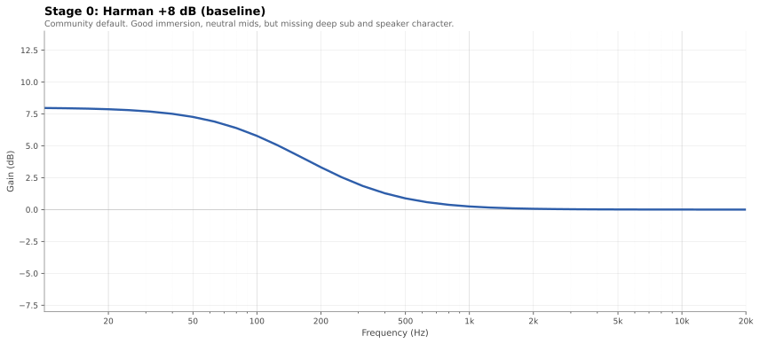
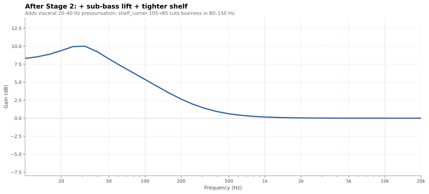
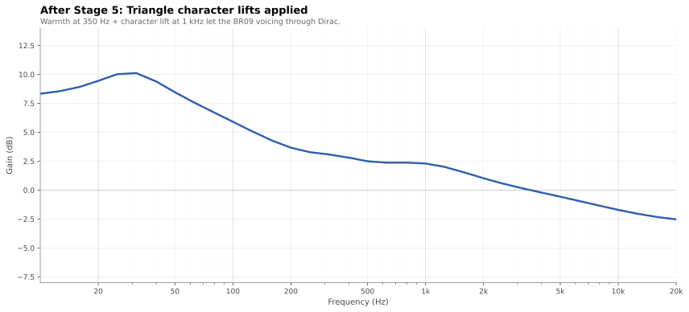
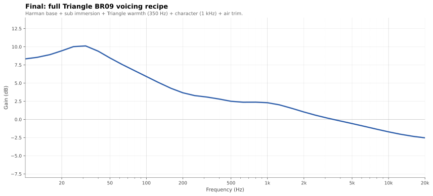
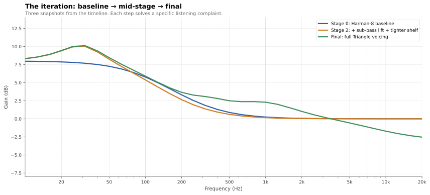

# Case study — voicing Triangle BR09 + SVS SB-2000 in Dirac Live

> ⚠️ **This curve is tuned for one specific system in one specific room.** Don't
> copy the final YAML expecting it to sound right on your gear. **Copy the
> process, not the curve.** The point of this doc is to show how to iterate
> on a target curve using listening cues and measurements as your guide.

A walk-through of building a personal target curve over roughly ten
listening sessions. Each section is structured as **complaint →
diagnosis → fix → result**, which is approximately how the iteration
actually unfolded.

## The system

| Component | Detail |
|---|---|
| **Mains** | Triangle Borea BR09 (3-way ported floor-stander, 1 × 25 mm silk dome tweeter with horn-flare waveguide + 1 × 16 cm midrange + 3 × 16 cm woofers) |
| **Sub** | SVS SB-2000 (sealed, -3 dB at ~19 Hz anechoic) |
| **Amp / DSP** | NAD C700 v1 with Dirac Live (BluOS) |
| **Crossover** | 80 Hz, 18 dB/oct (NAD bass management) |
| **Room** | Apartment living room, untreated, ~30 m² |
| **Listening** | Moderate-to-loud SPL, mixed music and occasional film |

A few things to know about the BR09: Triangle voices its speakers for
an energetic, forward presentation, with elevated upper-midrange
emphasis — they "want" to sound forward. That matters because Dirac
corrects toward whatever target curve you give it: if the target is
flat in a band where the speaker is intentionally not flat, Dirac
will treat that elevation as a room problem and cut it away, removing
the voicing along with it.

## Starting point: Harman +8 dB

The community default. A first-order low-shelf at +8 dB — the most
common starting point for music-focused Dirac calibrations, derived
from Olive/Welti's Harman International listener-preference research.



```yaml
base:
  type: harman
  params: { shelf_level: 8 }
```

**What was good**: solid bass weight, neutral mids, easy on the ears.
**What was wrong**: deep bass (below ~30 Hz) felt missing on
bass-heavy modern productions with significant sub-bass content —
the lowest notes were audible but lacked physical impact. And the
speakers felt "smoothed away" — less forward and articulate than they
sound un-corrected.

We tackled the sub-bass shortfall first (clearer fix, less subjective),
then the speaker-character problem (more nuanced).

## Stage 1 — Sub-bass immersion

**Complaint**: "I can hear the sub but the lowest notes don't have
the visceral, physical-pressure quality I expect at this SPL.
Sub-bass content (20–30 Hz) feels recessed."

**Diagnosis**: Harman-8 already plateaus at +8 dB down to 10 Hz, so
the target itself isn't capping the level. The issue is the
[equal-loudness contours](https://en.wikipedia.org/wiki/Equal-loudness_contour):
the contours steepen sharply below ~30 Hz, so a given SPL is
perceived as significantly quieter at 20 Hz than at 50 Hz. To make
the sub-bass band feel proportionate at typical listening levels,
the *target* needs extra energy in the 20–40 Hz band beyond the
shelf — psychoacoustic compensation, not flat reproduction.

**Fix**: A wide PEQ centred at 30 Hz, +2.5 dB with Q 0.9, to lift
the sub-bass band on top of the shelf.

```yaml
transforms:
  - peq: { freq: 30, gain_db: 2.5, q: 0.9 }
```

**Result**: sub-bass became physically perceptible on tracks with
deep low-frequency content. The 20–40 Hz region is now the loudest
band on the target — a deliberate over-flat shape that compensates
for the steepening equal-loudness contours at low frequencies. (Not
true isophonic compensation, which would require an SPL-dependent
target; just a bump in the right place at one assumed listening
level.) The fix exposed a secondary issue.

## Stage 2 — Boxiness fix

**Complaint**: "Now the 100 Hz region feels boxy — voices and
upright bass have a 'cardboard tube' quality."

**Diagnosis**: with the sub-bass PEQ added, the 80–150 Hz band ended
up at roughly +5 dB on the target. That's the classic "boxiness"
zone, and the room's modal response was likely piling up there too.
Two ways to address it: cut that band with a surgical `gain`
transform, or tighten the Harman shelf corner so the shelf decays
faster. Surgical band cuts leave non-natural shapes in the curve;
adjusting the shelf corner is cleaner.

**Fix**: move `shelf_corner` from the default 105 Hz down to 85 Hz —
the shelf falls off faster, cutting ~2 dB across the boxiness band.
(Spoiler: 85 turned out to be slightly too tight once the warmth
PEQ was added in Stage 5 — we relaxed it back to 95 in Stage 6.
Iterative tuning.)

```yaml
base:
  type: harman
  params: { shelf_level: 8, shelf_corner: 85 }
```

**Lesson**: when a complaint maps to a band, the first reflex
shouldn't always be a surgical PEQ. If the underlying shape is wrong,
fix the shape. Surgical EQs leave kinks in the curve; shape
adjustments don't.



## Stage 3 — Sibilance from full-range correction

**Complaint**: "With the curtain at 16 kHz, female vocals and
cymbals have audible sibilance and a harsh, glassy quality."

**Diagnosis**: with the curtain at 16 kHz and a flat target above
400 Hz, Dirac is being asked to make the room measure *flat* all the
way up. In a real listening room the in-room response naturally rolls
off above ~8 kHz (off-axis directivity of the speakers + absorption
by soft furnishings and carpet; atmospheric absorption contributes a
smaller portion). Correcting toward a flat target through that
naturally-rolled-off band lifts the 5–10 kHz region — exactly where
sibilance lives.

**Fix attempts** (this took a few tries):
- Switching to the `olive_welti_inroom` base with a -1 dB/oct tilt
  → too dark; the entire top end was rolled off rather than just
  the sibilance band
- A gentler -0.5 dB/oct tilt → still affected the bass (a downward
  tilt anchored at 1 kHz lifts everything below the anchor too,
  including the bass shelf)
- High-shelf cut at 4 kHz, -2 dB → cleaner, but trimmed too much
  of the 4–7 kHz band that gives transients their "snap"

**Final**: high-shelf cut at **7 kHz, -3 dB**. The first-order shelf
has a transition zone, so 4–6 kHz is lightly attenuated (about
-0.6 to -1.0 dB) — enough to leave most of the presence/snap intact;
above 7 kHz the cut deepens toward the full -3 dB, taming the
sibilance band (5–9 kHz) and the lower portion of the air band
(10+ kHz).

```yaml
transforms:
  - shelf: { type: high, corner: 7000, gain_db: -3.0 }
```

**Lesson**: a high-shelf is fundamentally different from a tilt.
The shelf only affects frequencies above its corner; the rest of
the curve is left alone. A linear tilt affects everything around
its anchor — useful for overall warming, wrong tool for surgical
treble-only adjustments.

## Stage 4 — Reading the L+R measurement to find speaker voicing

This was the breakthrough. After bass and treble were dialled in,
the BR09s still felt "smoothed away" in the midrange — less forward
and articulate than their natural character.

**Diagnostic move**: in the Dirac measurement view, switch to
**left and right channels overlaid** (instead of the average).
This separates two very different things:

- **Where L and R agree** = the speaker driver's intrinsic response,
  baked into the speaker.
- **Where L and R disagree** = the room. Asymmetric placement,
  position-dependent modes, single-side reflections.

Looking at the BR09 overlay:

| Band | L+R behaviour | Diagnosis |
|---|---|---|
| 30–80 Hz | L and R diverge by 5–10 dB | Room modes (correct) |
| 100–200 Hz | Some divergence | Mixed speaker + room |
| **200–500 Hz** | **L and R agree, +2 dB above target** | Speaker (warmth region) |
| **800 Hz–1.5 kHz** | **L and R agree, +4–5 dB above target** | Triangle's signature midrange forwardness |
| 2–4 kHz | L and R close, +1–2 dB above target | Speaker (presence) |
| Above 5 kHz | L and R tracking each other | Speaker rolloff + air |

The 200–2000 Hz elevation in both channels is the BR09's
**intentional voicing**. Dirac was cutting it down to flat, removing
the Triangle character entirely.

**Caveat**: L+R agreement isn't conclusive evidence of speaker
voicing on its own. Symmetric room modes (e.g. low-frequency
standing waves between parallel walls) also affect both channels.
The *width and smoothness* of the feature matter as much as the L/R
match: broad, smooth elevations across hundreds of Hz are
characteristic of speaker voicing; sharp single-frequency peaks
typically indicate modes.

**Lesson**: combine L+R overlap with shape — broad+smooth+matched
≈ speaker; narrow+spiky ≈ room. Use this to decide whether to EQ a
peak away or leave it alone.

## Stage 5 — Restoring the Triangle character

Two PEQs to lift the target back toward where the BR09 naturally
plays. Dirac then cuts those measured peaks less, letting the
speaker's voicing come through.

**The character lift** — 1 kHz, +2 dB, Q 0.6 (wide bell, roughly
1.5 octaves):

```yaml
transforms:
  - peq: { freq: 1000, gain_db: 2.0, q: 0.6 }
```

This covers 400 Hz – 2.5 kHz with the peak centred at 1 kHz —
matches the broad band where the BR09 naturally elevates the
upper-midrange.

**The warmth lift** — 350 Hz, +1 dB, Q 1.0 (narrower, focused):

```yaml
transforms:
  - peq: { freq: 350, gain_db: 1.0, q: 1.0 }
```

Picks up the separate ~300 Hz Triangle warmth bump that the wider
1 kHz PEQ doesn't fully reach.



**Result**: the BR09 character returned. Vocals more forward and
present, acoustic guitars more articulate, snare attack more
defined — without losing bass weight or re-introducing sibilance.

**Lesson**: if your speakers were chosen partly for their tonal
character, don't let Dirac flatten that character away. Lift the
target where the speaker naturally rises so Dirac cuts less there.

## Stage 6 — Restoring equilibrium

**Complaint**: "Adding the warmth PEQ at 350 Hz makes the curve
feel disconnected — there's a gap between the bass shelf and the
warmth lift."

**Diagnosis**: back in Stage 2 we tightened `shelf_corner` from
105 Hz to 85 Hz to reduce boxiness. With the new warmth PEQ adding
energy in 250–500 Hz, the over-tight shelf created a **valley** at
around 150–200 Hz between the bass shelf and the warmth band. The
curve fell into a hole, then climbed back out — visually weird, and
audible as a disconnect between the bass region and the warmth.

**Fix**: loosen `shelf_corner` from 85 to **95** — a compromise
between the default 105 and the over-tight 85. Lifts 100–200 Hz
by ~1 dB so the bass shelf flows continuously into the warmth band.

```yaml
base:
  type: harman
  params: { shelf_level: 8, shelf_corner: 95 }
```

**Lesson**: every parameter interacts with every other parameter.
A fix that solves a problem in isolation can create one elsewhere.
Always re-check the *shape* after adding a new transform.

## The final curve



```yaml
name: Living room (Triangle BR09 voicing)
output:
  path: living-room.targetcurve
  device_name: Living Room
  low_limit_hz: 10
  high_limit_hz: 24000

base:
  type: harman
  params:
    shelf_level: 8
    shelf_corner: 95         # Stage 2 + 6: tightened from 105 → 85, then relaxed → 95

transforms:
  # Stage 1: sub-bass immersion bump (equal-loudness compensation)
  - peq: { freq: 30, gain_db: 2.5, q: 0.9 }

  # Stage 5: Triangle warmth region (~300 Hz)
  - peq: { freq: 350, gain_db: 1.0, q: 1.0 }

  # Stage 5: Triangle character lift — preserve the speaker's natural
  # upper-midrange forwardness rather than flattening it
  - peq: { freq: 1000, gain_db: 2.0, q: 0.6 }

  # Stage 3: high-shelf cut to tame sibilance and air-band harshness
  - shelf: { type: high, corner: 7000, gain_db: -3.0 }

breakpoints:
  resolution: third_octave
  freq_range: [10, 20000]
```

## The journey, one chart



Stage 0 has the plateau at +8 dB; the Stage 2 snapshot adds the
+2.5 dB lift at 30 Hz (Stage 1) and tightens the bass shelf for
boxiness (Stage 2); the final adds the Triangle warmth and character
lifts (Stage 5) and the air-band high-shelf cut (Stage 3). Each step
is small; the cumulative effect is decisive.

## What I'd do differently

- **Read the L+R overlay sooner**. I spent several iterations
  guessing at "is this voicing or is this the room?" before
  switching to the per-channel view. That single diagnostic is
  much faster than iterating blind.
- **Use a high-shelf, not a tilt, for treble-only adjustments.**
  I initially reached for a downward tilt to tame HF harshness,
  thinking it was a "treble-only" tool. It isn't: a downward tilt
  anchored at 1 kHz also lifts everything below 1 kHz, which
  re-bloated the bass. A high-shelf only affects above its corner,
  so the rest of the curve stays untouched.
- **Adjust shelves before reaching for PEQs**. When the warmth
  band felt off, the first reflex was to add another PEQ.
  Adjusting `shelf_corner` by 10 Hz was the cleaner move and
  didn't introduce a new transform.

## What's transferable

For *your* system, the process — not the curve — is the gift:

1. **Start with a known-good baseline** (Harman-8 is fine).
2. **Listen on real music with sub-bass content**. Identify the
   biggest single complaint and frame it as a frequency band:
   - "Lacks impact" → 20–40 Hz
   - "Boxy" → 80–250 Hz
   - "Hollow" / "thin" → 200–500 Hz
   - "Sibilant" → 5–9 kHz
   - "Dull" → 10+ kHz
   - "Vocals smoothed away" → 200–2000 Hz
3. **Use the L+R overlay** in Dirac before adjusting anything. If
   a peak appears in both channels at the same frequency, it's
   most likely speaker voicing — don't EQ it away.
4. **Prefer shape adjustments over surgical EQ** when possible.
   Adjust the base curve's shelf or tilt parameters first; only
   reach for a PEQ when a surgical bump is truly needed.
5. **Reload, listen, repeat**. Each `curveforge build` takes a
   few seconds; you can iterate dozens of times in an evening.
6. **Keep the recipe in version control**. Diffing two YAML
   versions tells you exactly what changed between two listening
   states.

## Disclaimer (again)

The final YAML at the top of this doc will probably sound *wrong*
on your system if your speakers aren't Triangle BR09s, your sub
isn't an SB-2000, your room isn't a similar size and untreated, or
your listening level isn't moderate-to-loud. The shape changes
were targeted at a specific speaker's voicing and a specific
room's modes. Use the methodology to find your own.
